# databricks-ai-trip-planner-capstone

An AI-powered trip and outdoor activity planner built on Databricks Free Edition. Users save destinations and activities, and an AI agent builds a weather-aware itinerary — rescheduling outdoor plans when rain or poor air quality is forecast, and explaining why.

Built for the [Databricks AI Bootcamp capstone](https://github.com/EcZachly/databricks-ai-bootcamp-capstone) ("AI Trip and Outdoor Activity Planner" option), following patterns from three reference implementations — see [Acknowledgements](#acknowledgements).

## Status

Tracking progress phase by phase. Updated as each is completed.

- [x] **Phase 0** — Environment setup (Free Edition, LinkedIn verification, Lakebase instance, Git folder)
- [x] **Phase 1** — Lakebase schema
- [x] **Phase 2** — Spark ingestion pipeline (Open-Meteo + Wikimedia → Unity Catalog) — *verified end-to-end*
- [x] **Phase 3** — Embeddings + pgvector search in Lakebase — *verified end-to-end*
- [x] **Phase 4** — MCP server + AI agent — `mcp-trip-planner` and standalone `agent-trip-planner` both deployed and verified end-to-end via AI Playground
- [x] **Phase 5** — Databricks App frontend — `trip-planner-ui` (CRUD dashboard) deployed and verified end-to-end against live data. A chat panel embedding `agent-trip-planner` directly was scoped, researched (see Known limitations), and deliberately not built — the capstone requirements (frontend + agent with real tools) are already fully met by two separately deployed, both-working apps, and the panel would have added UX polish at the cost of the project's least-tested integration for no functional gap it was actually closing
- [x] **Phase 6** — Change data capture → Delta analytics — `lakebase_trip_planner` registered in Unity Catalog, `pipeline/sync_cdc.py` verified end-to-end (incremental sync, Delta history tables with native CDF, analytics)
- [ ] **Phase 7** — End-to-end test + submission

## Architecture

Three Databricks Apps, one Lakebase project, one Unity Catalog schema:

```
Open-Meteo API ──┐                                    ┌── weather/geocoding tool calls (live)
                  ├─→ Spark pipeline (bronze/silver/gold, Unity Catalog)
Wikimedia API ────┘              │
                                  ▼
                    Embeddings ──→ Lakebase Postgres (pgvector)
                                        │        ▲
                                        ▼        │
                          mcp-trip-planner (MCP tool server) ──▶ agent-trip-planner (chat, exported from AI Playground)
                                        │
                                        ▼
                            trip-planner-ui (Flask + Lakebase, itinerary/packing CRUD)
                                        │
                                        ▼
                                   End users
```

Vector search lives **inside Lakebase** via the `pgvector` extension rather than a separate Databricks AI Search endpoint — proven to work on Free Edition, and avoids relying on a second preview-quality quota-limited feature alongside CDF.

## Capstone requirements → where they're met

| Requirement | Implementation |
|---|---|
| Data pipeline in Spark | `pipeline/ingest_destinations.py` — geocode, weather, air quality, Wikipedia → bronze/silver/gold Delta tables |
| Third-party API integration | Open-Meteo (geocoding, weather, air quality) + Wikimedia (destination descriptions) |
| Unstructured data processing | Destination descriptions, attraction blurbs, and user notes chunked and embedded (`pipeline/ingest_embeddings.py`) |
| Databricks App with a frontend | `trip-planner-ui` (deployed, verified end-to-end against live data — trips/destinations/activities/itinerary/packing) + `agent-trip-planner` (chat) |
| AI agent with real read/write tools | `mcp_server/` (deployed as `mcp-trip-planner`, verified via AI Playground) — search, live conditions with reasoning, list/generate/reschedule/move-or-remove itinerary, packing list |
| CDF from Lakebase into a Delta table | `pipeline/sync_cdc.py` — verified end-to-end: `lakebase_trip_planner` registered as a read-only Unity Catalog catalog, incremental `MERGE` into Delta history tables with native `delta.enableChangeDataFeed = true`. See [Known limitations](#known-limitations--free-edition-notes) for why this path was used instead of Lakebase's own native CDF preview |

## Third-party APIs

- **[Open-Meteo](https://open-meteo.com/)** — geocoding, weather forecast, air quality. No API key, no signup. Free tier: 10,000 calls/day, 5,000/hour, 600/minute, non-commercial use, CC BY 4.0 attribution required.
- **[Wikimedia REST API](https://www.mediawiki.org/wiki/API:Main_page)** — destination descriptions and nearby attractions. No API key, but every request needs a descriptive `User-Agent` header identifying this project, or requests may be throttled.

## Repo structure

```
db/
  schema.sql               # trips, destinations, activities, itinerary_items,
                            # weather_snapshots, packing_items, agent_actions,
                            # destination_embeddings (pgvector), cdc watermark table
  seed.sql
  secret.py                 # one-time: stores the Lakebase connection string as a Databricks secret
  grant_app_access.sql     # only needed if the schema-run role differs from the app's role
pipeline/
  ingest_destinations.py   # geocode + Open-Meteo + Wikimedia -> bronze/silver/gold (Unity Catalog)
  ingest_embeddings.py     # run as a notebook, not a standalone file (see notes below)
  sync_cdc.py               # Phase 6: Lakebase -> Delta history tables, incremental MERGE + native CDF
mcp_server/                # -> Databricks App "mcp-trip-planner" (deployed, tested)
  weather_broker.py         # live Open-Meteo calls + threshold-based reasoning
  lakebase_broker.py        # pgvector search, trip/destination reads, itinerary/packing writes
  trip_mcp_server.py        # @mcp.tool functions: health, search_destinations, get_live_conditions,
                             # list_itinerary, generate_itinerary, reschedule_activity,
                             # build_packing_list, move_or_remove_itinerary_item
  app.yaml
  requirements.txt
ui_app/                    # -> Databricks App "trip-planner-ui" (deployed, verified)
  app.py                   # Flask routes: trips, destinations, activities, packing (all browser-facing)
  lakebase.py               # same pg8000 connection pattern as mcp_server
  templates/
    base.html
    index.html              # trip list + create-trip form
    trip_detail.html        # destinations/activities, read-only itinerary, packing toggle
  app.yaml
  requirements.txt
check_environment.py       # Phase 0 sanity check: outbound reach + pgvector extension
screenshots/                # working-system evidence, referenced in the README
```

`agent-trip-planner` (the chat agent) has no source folder here — it's generated by AI Playground's "Export to Databricks Apps" once `mcp-trip-planner`'s tools are wired up.

## Setup

1. [x] Sign up for [Databricks Free Edition](https://www.databricks.com/learn/free-edition) and complete **LinkedIn verification** (unlocks outbound internet beyond the default trusted-domain allowlist — required to reach Open-Meteo and Wikimedia).
2. [x] Push this repo to GitHub, then in the Databricks workspace: **Workspace → Create → Git folder**, point it at the repo.
3. [x] **Catalog → Lakebase → Create Lakebase instance**. Once **Available**, under **Roles & Databases**, create a password-auth role and copy the connection string.
4. [x] Run `db/schema.sql` in the Lakebase SQL editor, then `db/seed.sql`.
5. [x] Run `%sh python db/secret.py` from a notebook cell — prompts (via `getpass`) for the Lakebase connection string from step 3 and stores it as a Databricks secret (`trip-planner`/`lakebase-url`). If `getpass` misbehaves in a `%sh` cell, use the Web Terminal instead.
6. [x] Edit the `WIKIMEDIA_USER_AGENT` placeholder in both `check_environment.py` and `pipeline/ingest_destinations.py` — Wikimedia's API etiquette requires a real contact, not a placeholder or `example.com` address.
7. [x] Run `check_environment.py` (`%sh python check_environment.py`) — confirms outbound reach to Open-Meteo (geocoding/forecast/air-quality) and Wikimedia, that the User-Agent was actually edited, and that the Lakebase connection + `pgvector` extension both work. Fix any `[FAIL]` line before moving on.
8. [x] Run `pipeline/ingest_destinations.py` as an actual notebook (not the file-editor "Run" button — it creates the `trip_planner` catalog/schemas/tables itself on first run, no manual pre-creation needed).

## Known limitations / Free Edition notes

Learned the hard way across the reference repos — documenting up front so they don't cost time twice:

- **Outbound internet is allowlisted by default.** LinkedIn verification is required before any external API call will succeed from serverless compute.
- **`psycopg2-binary` can abort the entire Python kernel (SIGABRT, exit code 134) on Free Edition serverless notebooks** — same failure class as other packages that bundle compiled native extensions (`cv2`, `pymssql`) hitting missing/mismatched shared libraries in the container. Switched to `pg8000` (pure Python, no compiled extensions) for all Lakebase connections in notebooks; it takes keyword args rather than a `postgresql://` URL, so connection helpers parse the URL manually.
- **Postgres UUID columns come back as Python `uuid.UUID` objects**, not strings — from both `pg8000` and `psycopg2`. Spark's `createDataFrame()` schema inference has no idea what to do with a raw `uuid.UUID` object and fails outright. Cast to `str()` at the point each id is read from the database, before it flows into anything Spark-bound.
- **Spark's `createDataFrame()` schema inference from a list of Python dicts is fragile** — it fails if a field's value is `None` across every sampled row (can't infer *any* type) or if the same field is `int` in some rows and `float` in others (e.g. a JSON API returning `1200` vs `1234.5` for the same logical field). Give explicit `StructType` schemas to any DataFrame built from external API data rather than relying on inference — this class of bug hit `destination_id`, `distance_m`, and `air_quality_index` in `pipeline/ingest_destinations.py` before all `createDataFrame()` calls there were pinned to explicit schemas.
- **Open-Meteo's "16-day forecast" counts today as day one** — the furthest valid `end_date` is `today + 15`, not `today + 16`. Off by one here gets a `400` with a `reason` field naming the actual allowed range.
- **Open-Meteo's air-quality API has its own, shorter forecast horizon that isn't documented alongside the main weather API's** and can drift day to day — don't hardcode a day count for it. `fetch_air_quality_safe()` in `pipeline/ingest_destinations.py` parses the allowed range straight out of the API's own error message and retries once with the corrected window, falling back to weather-without-AQI rather than losing the whole row if it still can't get air-quality data.
- **Always capture the response body on 4xx errors from Open-Meteo/Wikimedia**, not just the status code — both return a JSON `{"error": true, "reason": "..."}` body that names the exact problem, which `raise_for_status()` alone discards.
- **Lakebase's native Change Data Feed is Public Preview and currently unreliable on Free Edition** — there are open reports of the destination Delta table never appearing after a successful-looking setup. Plan is to fall back to registering Lakebase as a read-only Unity Catalog foreign catalog and running a scheduled incremental `MERGE` into a Delta table with native `delta.enableChangeDataFeed = true`, rather than depending on the Lakebase-side preview.
- **Databricks Apps only allow programmatic (Bearer-token) access under `/api/`** — routes outside that prefix expect a browser session and return 401 to scripts/curl.
- **Calling a deployed app from a notebook needs a token-exchange step**, not a plain `WorkspaceClient().config.authenticate()` call — that only works for service-principal/app-to-app callers.
- **Each standalone file "Run" gets a fresh, ephemeral serverless environment.** Packages installed by one script run don't persist into the next — scripts that need dependencies should self-install them at the top of their own execution.
- **`torch`/`sentence-transformers` should be installed via a notebook's Environment side panel**, not mid-script `pip install` — doing it mid-script has caused kernel crashes. `pipeline/ingest_embeddings.py` must be run as an actual notebook, not the file-editor "Run" button.
- **No relevance floor on search results — flagged for Phase 4.** With only a handful of chunks in the index so far, pgvector's `<=>` always returns *something* as the top match regardless of whether it's actually relevant. Confirmed while testing `search_destinations()` at the end of `pipeline/ingest_embeddings.py`: a query about a coastal city with hiking nearby returned a Mount Rainier clouds/rain chunk as the top result at only 21% similarity — mechanically correct, semantically wrong. Same gap the `weather-intelligence` reference repo hit (they used ~40% as a rough cutoff). The Phase 4 MCP `search_destinations` tool should treat low-similarity results as "no good match" rather than confidently returning the top-k regardless.
- **Registering an MCP server as a Unity Catalog "MCP Service" via AI Gateway fails with 401 on Free Edition** (the Managed MCP Servers preview isn't enabled). Use the **Custom MCP Server** tool picker in AI Playground/Agent Bricks instead — any deployed app named `mcp-*` is auto-discovered there with no extra registration step.
- **Grant table access explicitly** if the Postgres role that ran `db/schema.sql` differs from the role the deployed app connects with (`db/grant_app_access.sql`).
- **The `mcp` Python SDK released a breaking `2.0.0`** that renamed `FastMCP` to `MCPServer` and moved the module — `from mcp.server.fastmcp import FastMCP` (what our code and Databricks' own official docs both use) stops working with a `ModuleNotFoundError` on `mcp>=2.0.0`. Pin `mcp<2.0.0` in `mcp_server/requirements.txt`.
- **Databricks Apps secrets aren't declared in `app.yaml` itself** — only referenced there. The actual scope/key wiring happens once via the app's own page → App resources → + Add resource → Secret, where you assign it a "resource key" name; `app.yaml` then just has `env: - name: LAKEBASE_URL / valueFrom: <that resource key>`. (Declaring it directly in `app.yaml` is only possible via Databricks Asset Bundles, which this project doesn't use.)
- **Lazy-loading a heavy model (e.g. the embedding model for `search_destinations`) on first request risked a stream timeout** — the first real call in testing failed with `RST_STREAM`/`INTERNAL_ERROR` while `sentence-transformers` downloaded and initialized inline; an immediate retry succeeded fast once it was cached in memory. Fixed by loading the model once at app startup (module level in `trip_mcp_server.py`) instead of lazily inside the tool function — same root lesson as the notebook torch-install issue, different mechanism.
- **Malformed or hallucinated ids from the agent hit Postgres directly and leak a raw `invalid input syntax for type uuid` error** if nothing validates them first — confirmed in testing when the model passed literal placeholder text (`"Seattle's destination ID"`, `"the trip id"`) instead of a real id. Every `lakebase_broker.py` function that looks up a single row by id now validates the format with Python's `uuid` module before querying, returning a clean not-found response instead.
- **Tool names that are too similar cause the LLM to pick the wrong one** — `get_itinerary` (read) and `generate_itinerary` (write, schedules new items) were confused by the model in testing; a request to "generate the itinerary again" called the read-only tool and silently did nothing. Renamed to `list_itinerary` to reduce the name collision, and made both tools' docstrings explicitly cross-reference each other and state up front whether they write to the database.
- **LLMs will invent a placeholder value (e.g. `"the trip id"`) for a required parameter rather than asking, if it's not actually in context** — same pattern as the malformed-id issue above, but preventable at the source. Every tool parameter that takes an id now has explicit docstring language: "never invent, guess, or use placeholder text — ask the user instead." Worth remembering when testing across separate Playground sessions: a trip id established in one conversation doesn't carry into a new one, so give it explicitly in the first message of any fresh session rather than assuming it's still "known."
- **The exported `agent-trip-planner` app's auto-generated chat UI can throw a client-side `"Unhandled item type or structure"` error on the second message in a session**, even though the underlying response is a well-formed message — this is a frontend rendering gap in the "Export to Databricks Apps" template (a genuinely new feature as of mid-2026), not a failure in the agent, tools, or Lakebase underneath. Workaround: refresh the page and re-ask. Given this, `ui_app/`'s own chat panel (Phase 5) — which calls this same deployed agent directly from code we control — is the more dependable place to demo the agent, not this template's widget.
- **Each Databricks App needs its own secret resource wired, even when it's the same underlying secret.** Adding the `lakebase-url` resource to `mcp-trip-planner` did not make it available to `trip-planner-ui` — every app that reads `LAKEBASE_URL` needs its own App resources → + Add resource → Secret step pointing at the same scope/key.
- **`build_packing_list`'s dedup is exact-match (case-insensitive), not fuzzy** — confirmed visually in `trip-planner-ui`: the agent's baseline `"Passport or ID"` suggestion sits right next to a seeded `"Passport"` item rather than being recognized as a duplicate. Not a bug, just a real limitation of exact-string dedup worth knowing before it looks like one in a demo.
- **App-to-app calls between two Databricks Apps use a simpler auth path than notebook-to-app calls** — `WorkspaceClient().config.authenticate()` with no explicit credentials, using the calling app's own service principal, rather than the token-exchange dance notebooks need. The exported agent template exposes `POST <app-url>/responses` (aliased as `/invocations`), request `{"input": [{"role": "user", "content": "..."}]}`, response in OpenAI Responses API shape. Researched and scoped for a `ui_app` chat panel, then deliberately not built — see Phase 5 status above for why. Preserved here in case it's worth building later: the integration itself was never actually exercised, so treat this contract as documented-but-unverified, not proven.
- **Registering Lakebase in Unity Catalog looks different depending on the Lakebase tier.** The **Provisioned** tier has a "Catalogs" entry in its own product sidebar (Lakebase Postgres → Provisioned → instance → Catalogs → Add catalog). The **Autoscaling** tier (what this project uses) doesn't show that entry at all — registration instead happens through **Catalog Explorer → Create a catalog → Type: Lakebase Postgres**, which explicitly supports both tiers via a Database type toggle. Same underlying capability, different UI entry point — not a missing feature.
- **Querying a registered Lakebase catalog requires Serverless SQL Warehouse compute** — Pro/Classic warehouses return a permission error, and with no compute attached at all Catalog Explorer just shows "No data to display, active cluster or warehouse is required." Free Edition's default serverless compute satisfies this without extra setup, but it's not automatic — compute has to be explicitly selected in Catalog Explorer the first time.
- **`agent_actions` only logs write actions, not every MCP tool call.** `generate_itinerary`, `reschedule_activity`, `build_packing_list`, and `move_or_remove_itinerary_item` call `log_agent_action`; `search_destinations`, `get_live_conditions`, and `list_itinerary` (pure reads) deliberately don't. A schema comment originally said "every MCP tool call," which overstated this — corrected in `db/schema.sql`. Confirmed via real data: 7 tools used extensively in testing, only 4 tool names ever appear in `agent_actions_history`.
- **History tables built on soft-delete source data can make naive `GROUP BY status` analytics misleading.** `move_or_remove_itinerary_item`'s "remove" action only ever sets `is_deleted = true` — it never touches `status`, since a removed item was never rescheduled. Confirmed in testing: `itinerary_items_history` showed `status = 'planned', count = 5` after a remove-then-regenerate cycle, which reads as "5 active items" but is actually 4 active + 1 correctly-preserved-but-deleted row. The sync captured this exactly right (a history table should keep deleted rows, not drop them); the fix was adding `is_deleted` to the analytics query's `GROUP BY`, not changing what gets synced.

## Screenshots

Phase 4 (MCP server + agent), verified end-to-end:

**`mcp-trip-planner` deployed and reachable from AI Playground** — the `health` tool confirming the server is live and can reach Lakebase.
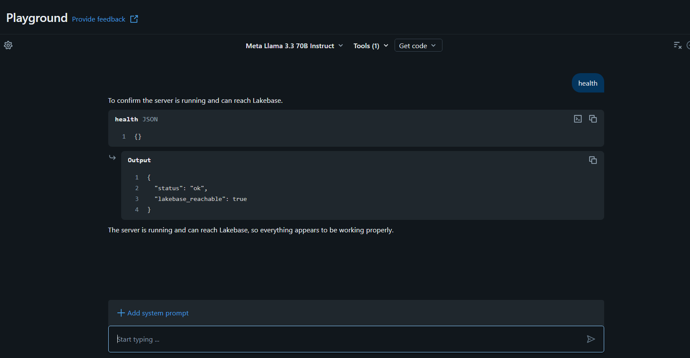

**`search_destinations` with the relevance floor working** — an honest "no strong match" instead of a confidently wrong top result, per the fix flagged in Phase 3.
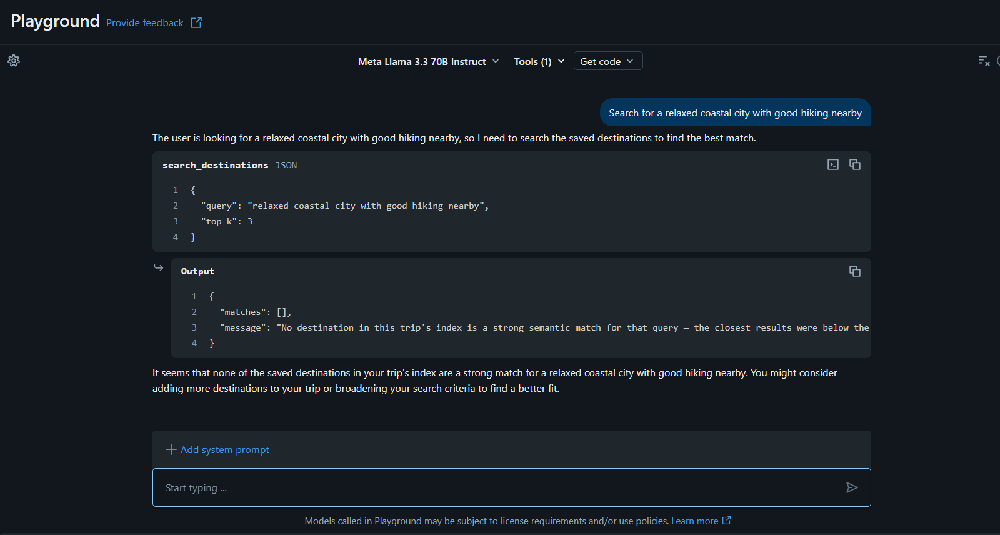

**`get_live_conditions` returning real forecast data with explainable reasoning** — the tool that satisfies the capstone's "explain why it made each weather-based change" requirement.
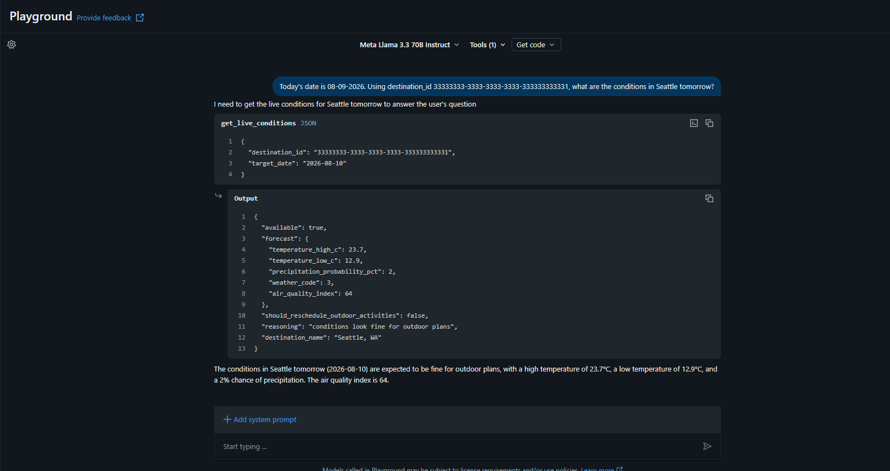

**`generate_itinerary` actually scheduling an activity**, not just returning a stub — Kerry Park Viewpoint re-added after removal, with the scheduling logic's own explanation in `notes`.
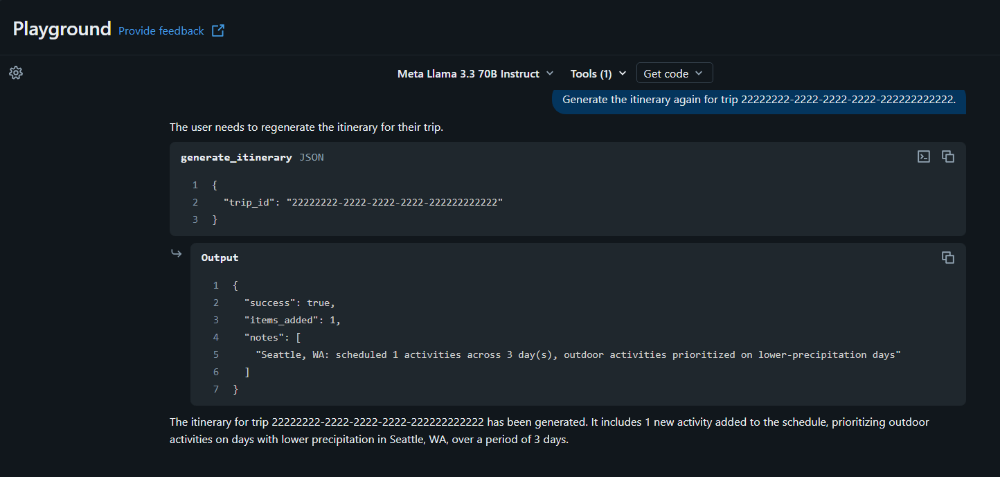

**`agent-trip-planner`** — the standalone chat agent, exported from AI Playground via "Export to Databricks Apps," running as its own deployed Databricks App.
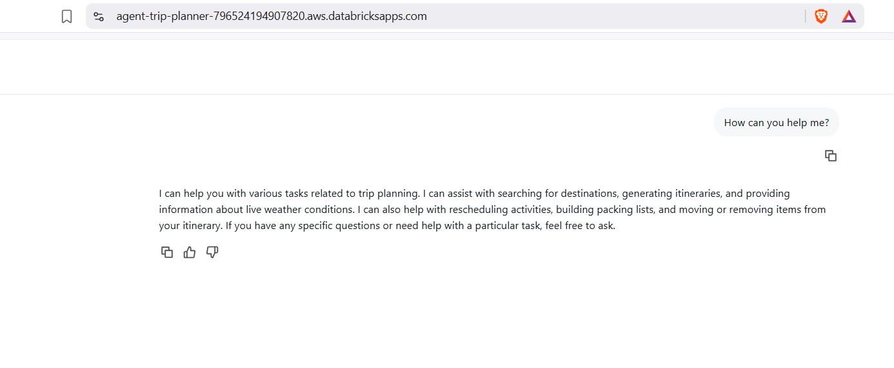

Phase 5 (frontend), verified against live data — not empty-state screenshots:

**`trip-planner-ui` trip list** — the seeded "Pacific Northwest Hiking Trip" rendering with its real dates, proving the UI reads the same live Lakebase data every other phase writes to.
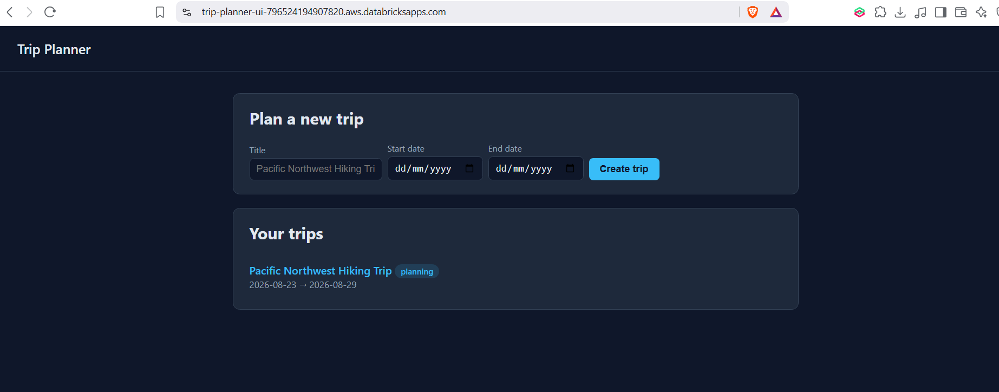

**Trip detail with real pipeline data** — Seattle's actual Wikipedia description (from Phase 2) and its activities rendering correctly, not placeholder text.
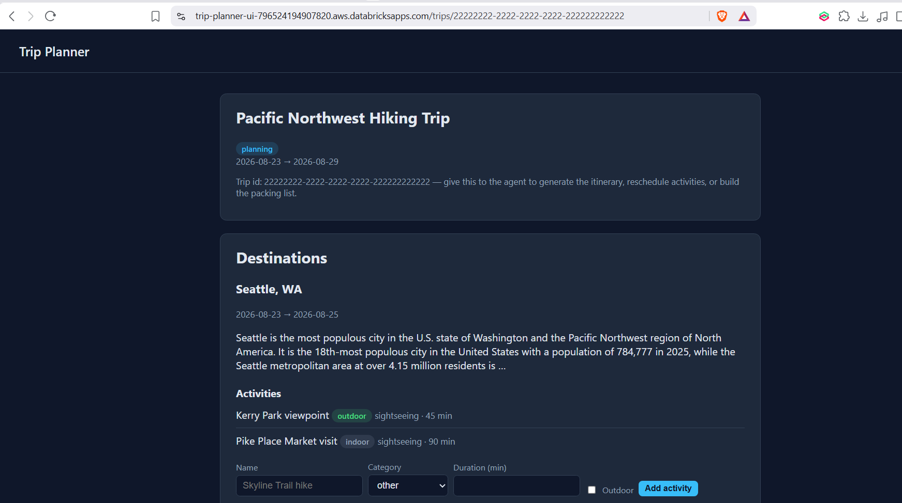

**Packing list toggle working end-to-end** — click → POST → Lakebase write → redirect → re-render, with the toggled item correctly sorting to the bottom and getting struck through.
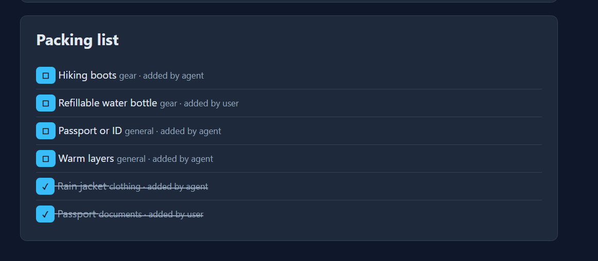

Phase 6 (CDC → Delta analytics), verified end-to-end:

**`lakebase_trip_planner` registered in Unity Catalog** — every table from `db/schema.sql` visible and queryable through the read-only catalog mirror, once Serverless SQL Warehouse compute is attached.
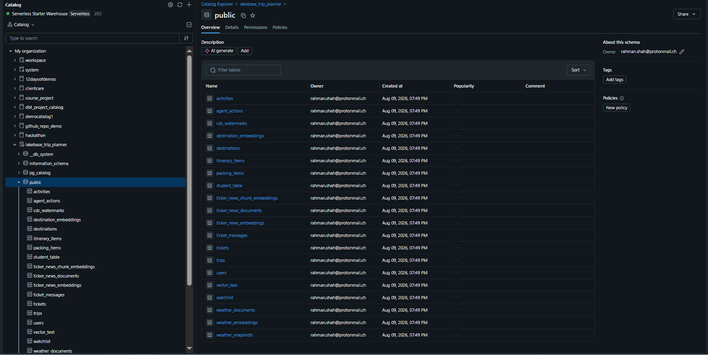

**First incremental sync run** — real row counts across every watched table, not zeros, since every table already had real data from Phases 1–5.
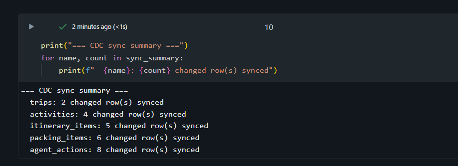

**Corrected itinerary analytics** — `is_deleted` broken out explicitly, catching the gap where a naive status count would have conflated an active item with a correctly-preserved-but-removed one.
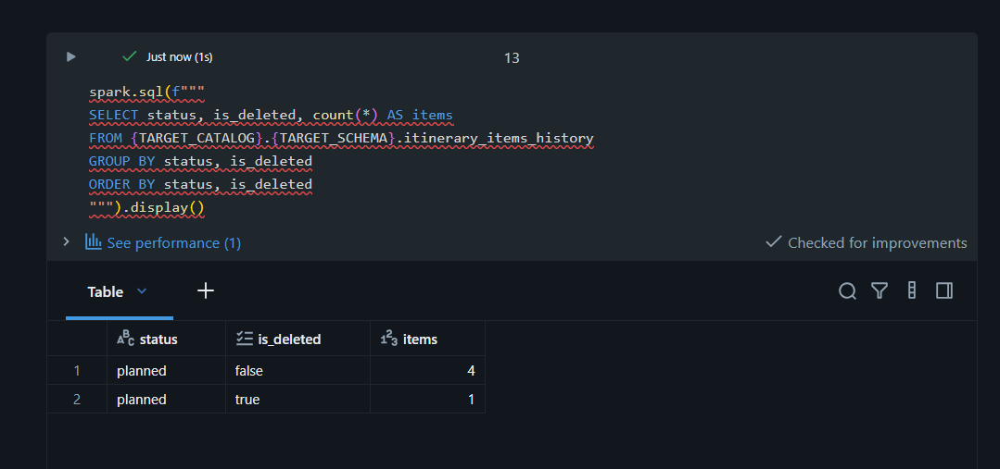

## Acknowledgements

Structure and Free Edition patterns adapted from:

- [EcZachly/databricks-ai-bootcamp-capstone](https://github.com/EcZachly/databricks-ai-bootcamp-capstone) — the capstone brief this project fulfills
- [rahmanshah/databricks-lakebase-app-weather-intelligence](https://github.com/rahmanshah/databricks-lakebase-app-weather-intelligence) — pgvector-in-Lakebase pattern
- [rahmanshah/databricks-weather-mcp-agent](https://github.com/rahmanshah/databricks-weather-mcp-agent) — MCP server + Export-to-Apps agent pattern
- [rahmanshah/databricks-lakebase-app-ticketing-system](https://github.com/rahmanshah/databricks-lakebase-app-ticketing-system) — Flask + Lakebase CRUD app pattern